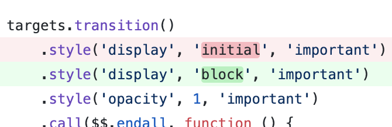

class: center, middle
# レビューの話

日野澤 よしや

twitter.com/kt3k

---
class: center, middle

レビューしてますか?

---
class: center, middle

ここ1週間でコードレビューした人 🙋‍♀️🙋‍♂️

---
class: center, middle

ここ1週間で LGTM 以外のレビューをした人 🙋‍♀️🙋‍♂️

---
class: center, middle

# LGTM

---
class: center, middle

# LGTM = Looks Good To Me.

---
class: center, middle

# LGTM = (It) Looks Good To Me.

=> それは良さそうに見えます.

=> 良さそうです.

---
class: center, middle
たまに見る LGTM 以外のレビューがつかないチーム

---
class: center, middle
そのコード本当に「良さそう」に見えていますか?

---

# 自己紹介

- 日野澤 歓也(ひのさわ よしや)
- 2015 - 2019 RLS Air シリーズのフロントエンド開発/設計をしていました.

 

---
# 自己紹介

- 得意な技術: Webpack, React, Gulp
  - この辺で困ったら slack で相談/質問してください

---

class: middle, center
## レビューの第一歩

---
class: middle, center

これなんか変だな, と思ったとします

---
class: middle, center

🤔「なんか変だけど, 良くわからん・・・」

---
class: middle, center

# LGTM!

🙅‍♀️

---
class: middle, center

なんらかの言語化をしましょう.

---
class: middle, center

🤔「これなんか変だな」

---
class: middle, center

✍️「これなんか変です」

---
class: middle, center

✍️「これ, おかしいです」

---
class: middle, center

✍️「これ, ダメだと思います」

---
(たまに見る)

## 「何が」が書かれてないレビュー

- 「おかしいとおもいます」
- 「ダメだと思います」
- 「これ, 違和感があります」

🙅‍♀️ 対応しようがないのでレビュイーはすごい困る.

必ず「何が」おかしいと思っているのかを言語化しましょう.

---
class: middle, center

🤔「これなんか変だな」

---
class: middle, center

🤔「これ `block` じゃなくて, `inherit` だ」

---
class: middle, center

✍️「`inherit` です」

---
class: middle, center

✍️「`inherit` です」

## 惜しい!

けど 🙅‍♀️ まだちょっとダメなレビュー

---
class: middle, center

✍️「`inherit` です」

↑これが指摘として正しいなら, 良いレビューと言えば良いレビュー

ただし, 指摘として間違ってたら「は?」てなって消耗

---
class: middle, center

✍️「`inherit` です」

完全に上から目線なレビュー.

相手もプロとしてコードを出してきているので, それを否定してしまうのはちょっと失礼.

---
class: middle, center

# 答え

✍️「`inherit` ではないでしょうか?」 
✍️「`inherit` かと思ったのですがどうでしょう?」

あくまで自分の意見を述べる形のレビュー

(語尾はキャラクターによって調整してください)

---
class: middle, center
✍️「ぇ~! これって `inherit` じゃないのぉ?」 

✍️「`inherit`?」 

✍️「`inherit` じゃないんすか?」 

相手に, 反論の余地を残した言い方. 相手にも優しい, 自分にも優しい.

---
# バグってはいない場合のレビュー

TBD

---
# 可読性についてのレビュー

TBD

---
# レビューしないための技術

- lint
- formatter
- storybook

---
# lint, formatter

コードのスタイルなどの, 観点の違いの議論が発生しがちな部分を機械の力で解決するツール. レビューの効率を上げるためにどんどの導入しましょう.

---
# storybook

レビュワーがチェックアウトして, 手元でビルドして, という手順を省けるようになるツール.

レビューする苦痛がかなり減るので, おすすめです.

---
# レビューの危機管理

---
# まとめ
- 質問から始める.
- 決めつけない.
- 観点/視点の違いがありえるレビューは慎重に.
  - 常に1つだけの正解があるとは限らない.
- レビューでできる範囲には限界がある.
  - やばいと思った時はレビューの枠を超えた解決法を探す

---
class: middle, center
ご清聴ありがとうございました.
